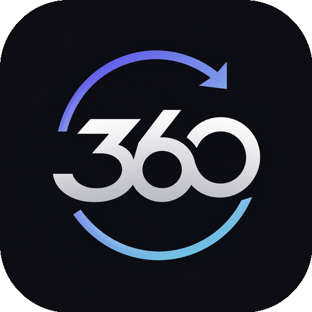
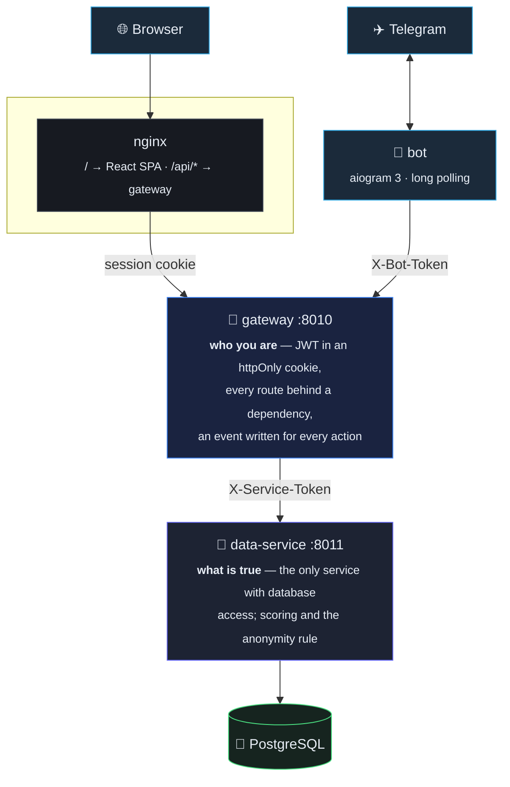
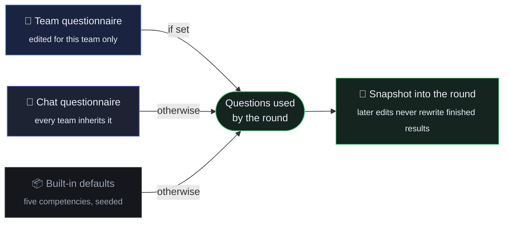
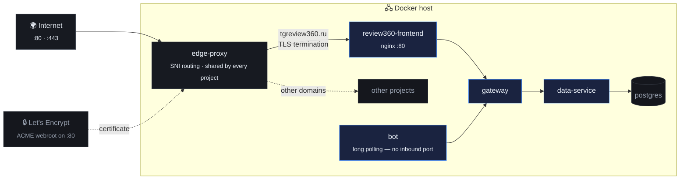
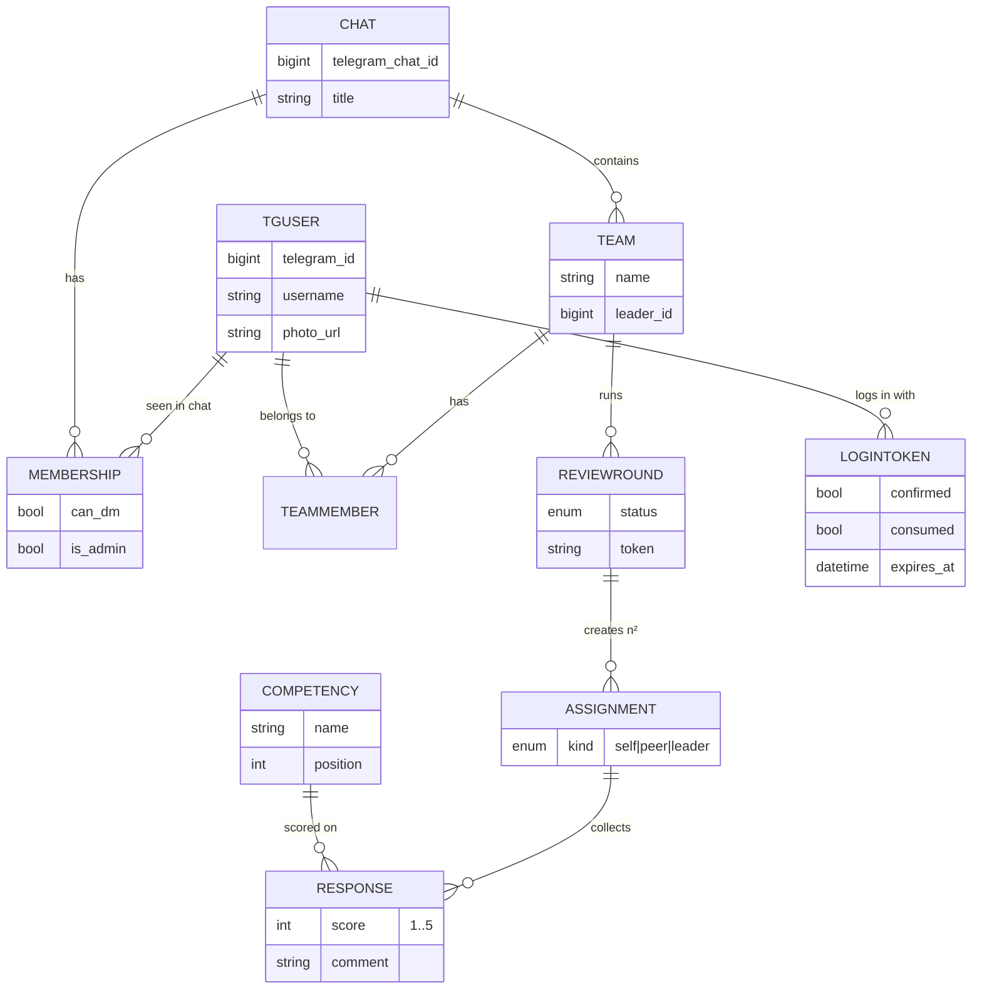

<div align="center">



# Review 360

**360° feedback for teams, run entirely from a Telegram group — add the bot to your work chat, drag people into teams on the web, and everyone answers in their own DM.**

[](https://tgreview360.ru)
[](https://t.me/tgreview360bot)
[](https://www.python.org/)
[](https://fastapi.tiangolo.com/)
[](https://aiogram.dev/)
[](https://react.dev/)
[](https://www.postgresql.org/)
[](https://docs.docker.com/compose/)
[](LICENSE)

<!-- DEMO: drop docs/demo.gif in place and uncomment the line below

-->

**🎥 Demo — coming up:** a full walkthrough from an empty group chat to a finished 360° review — the roster filling itself, drag-and-drop team building, the questionnaire panel, the review inside Telegram, and the live results dashboard.

<sub>Meanwhile the live instance is at <a href="https://tgreview360.ru">tgreview360.ru</a>.</sub>

</div>

---

## 📋 Contents

[The problem](#-the-problem) · [The idea](#-the-idea) · [How it works](#-how-it-works) · [Telegram limits](#-two-telegram-limits-and-the-way-around-them) · [Architecture](#️-architecture) · [Anonymity](#-anonymity-is-a-rule-not-a-setting) · [Scoring](#-scoring) · [Interface](#-interface) · [Quick start](#-quick-start) · [Deployment](#-production-deployment) · [API](#-api) · [Data model](#️-data-model) · [Testing](#-testing) · [Roadmap](#️-roadmap)

---

## 🎯 The problem

360° review is one of the few HR instruments that actually changes behaviour: you learn how the team sees you, not how your manager summarises it. The method is not the hard part — **the logistics are**.

The usual attempt looks like this:

- **A spreadsheet.** Someone builds a matrix of who rates whom, exports it, and mails out links.
- **Two weeks of chasing.** Half the team forgets, the other half fills it in on the last day.
- **Manual aggregation.** Averages are computed by hand, so mistakes are invisible.
- **Broken anonymity.** In a team of four, "the average of your peers" plus a bit of arithmetic identifies the author of a low score immediately — and everyone knows it, so nobody writes anything honest.
- **Stale results.** By the time the deck is ready, the quarter is over.

The instrument is fine. The delivery kills it.

## 💡 The idea

Run the whole thing **where the team already talks**. No accounts, no invitation emails, no forms — a Telegram group, a button, and about five minutes per person.

1. The bot joins the work chat and **picks the roster up by itself** — admins, joins, and anyone who writes.
2. Teams are assembled on the web by **dragging** members into a team and putting a crown on the leader.
3. One press of *Start* and the bot tags everyone in the group, handing each person a **personal deep link**.
4. Each participant answers **in their own DM**, inside a single message that keeps being edited — the reviewee's photo above the question, no wall of messages.
5. Results appear on the dashboard and inside the bot, with anonymity enforced by the backend rather than by good intentions.

And the number that matters is never the average. It is the **gap between self-assessment and how the team sees you** — every chart here is built around that axis.

## 🔄 How it works

```mermaid
flowchart LR
    subgraph TG["💬 Telegram group"]
        A["Bot joins the chat"] --> B["Roster assembles itself<br/>admins · joins · anyone who writes"]
    end

    subgraph WEB["🖥️ Web"]
        C["Log in through the bot<br/>one-time deep link"] --> D["Drag members into teams<br/>crown the leader"]
        D --> E["Press «Запустить»"]
    end

    subgraph DM["📩 Telegram DM"]
        F["One card, edited in place<br/>photo of the person being rated"] --> G["1–5 per competency"]
        G --> H["Anonymous free-text note"]
    end

    subgraph RES["📊 Results"]
        I["Radar per person<br/>self vs team"] --> J["Anonymous comments<br/>≥3 answers only"]
    end

    B --> C
    E -- "bot tags everyone,<br/>hands out personal links" --> F
    H --> I

    classDef tg fill:#1b2a3a,stroke:#2CA5E0,color:#e8eef6
    classDef web fill:#1a2340,stroke:#3b82f6,color:#e8eef6
    classDef res fill:#1d2a22,stroke:#4ade80,color:#e8eef6
    class A,B,F,G,H tg
    class C,D,E web
    class I,J res
```



Every round creates three kinds of assignment per member: **self**, **peer** (everyone else), and **leader** — the leader's view is stored separately so it never dilutes the peer average, because one strong opinion from above is not the same signal as the team's.

## 🔐 Two Telegram limits, and the way around them

This is the part that decides whether such a product is even possible.

| Limit | Reality | What we do |
|---|---|---|
| **A bot cannot list group members** | The method was removed from the Bot API for privacy — only `getChatAdministrators`, `getChatMemberCount` and per-user lookups remain | The roster is **assembled passively**: the full admin list, every `chat_member` join/leave, and the author of any message sent while the bot is in the chat. Nobody presses anything |
| **A bot cannot message someone first** | Telegram requires the user to open the dialog | The group post carries a **personal deep link** (`t.me/bot?start=<token>`). Pressing *Start* opens the dialog *and* begins that person's review in one motion |

> **Give the bot admin rights in the group** (or turn Group Privacy off in
> BotFather). With privacy mode on — the default — Telegram only forwards
> commands and replies to the bot, so it cannot notice everyone else writing and
> the roster fills up far more slowly. Admins are always visible either way, and
> `/members` in the chat re-syncs on demand.

The same mechanism powers **login**. The site has no Telegram Login Widget — it needs a BotFather-registered domain and never works on localhost. Instead the site mints a **one-time token**, opens the bot with it, and polls until the bot confirms. Tokens are single-use and expire in ten minutes; the session then lives in an httpOnly cookie.

## 🏗️ Architecture

Four services behind a single nginx entry point. Nothing except nginx is exposed.



**Why split the gateway from the data-service?** Because the anonymity rule has to live in exactly one place. The gateway owns identity — sessions, cookies, statistics. The data-service owns truth — schema, aggregation, the minimum-responses threshold. Neither the browser nor the bot can reach the data layer without the service token, so there is no path that returns an individual peer score, whatever the caller asks for.

Both FastAPI services share the same skeleton: app-factory, `routes / schemas / services / engine / utils`, Prometheus metrics on `/metrics`, and an OpenAPI spec written to `openapi_spec/` on every boot.

```
review-360/
├── gateway/         public API: auth, chats, teams, rounds, bot bridge
│   └── app/{routes,schemas,services,utils}
├── data-service/    database, scoring engine, anonymity
│   └── app/{routes,schemas,engine,models,utils}
├── bot/             aiogram 3 — roster sync, DM review, results
│   └── app/{handlers,keyboards,services}
├── frontend/        React 18 + TypeScript + Vite + Tailwind v4
├── nginx/           single entry point
├── openapi_spec/    generated on boot
├── tests/           end-to-end flow test, 35 assertions, no mocks
├── docs/            architecture notes, demo material
└── docker-compose.yaml
```

More detail: [`docs/ARCHITECTURE.md`](docs/ARCHITECTURE.md).

## 🕶️ Anonymity is a rule, not a setting

The method collapses the moment people suspect they can be identified — so this is enforced in the aggregation engine, with no switch in the UI to turn it off:

- Peer averages are returned **only when at least three people have answered** (`MIN_RESPONSES_FOR_RESULTS`). Below that the card shows a lock and no number at all.
- **Individual peer scores are never returned by any endpoint** — only averages. There is no "raw answers" view, not even for the leader.
- Free-text notes come back as a **shuffled list of strings with no author**, held back by the same threshold.
- **Self and leader assessments are labelled**, precisely because they are attributable by construction: everyone knows there is exactly one of each, so pretending otherwise would be the dishonest choice.

## 📝 Questionnaires

Questions are not hard-coded. They resolve at three scopes, most specific first:



A side panel on the chat page edits the shared list — add, rename, reorder by
dragging, delete, 1 to 20 questions. **«Обновить у всех команд»** drops every
team's override so the whole chat is back on one questionnaire.

Each team has the same panel. It opens showing what the team currently inherits;
saving turns those into the team's own, leaving other teams untouched, and
«Как в чате» hands it back.

Two rules keep history honest: a round **snapshots** its questionnaire when it
starts, so editing questions later cannot rewrite finished results; and a
question that already carries answers is **deactivated rather than deleted**.

## 📊 Scoring

The seeded defaults, used until someone edits them:

| Competency | What it asks about |
|---|---|
| Коммуникация | Explains clearly, listens, gives feedback |
| Ответственность | Keeps promises, finishes what was started |
| Экспертиза | Knows the craft, solves problems well |
| Инициатива | Proposes improvements without being asked |
| Командность | Helps colleagues, works for the shared result |

Each is rated 1–5. For every person the engine produces the self score, the peer average, the leader's score and the overall figures — and the dashboard draws all of it as a radar chart with self and team overlaid, because the shape of the gap is more informative than any single number.

## 🖥️ Interface

- **Login** — a decoding headline (rAF text-scramble, stepped on a timer, `aria-label` for screen readers, instant for `prefers-reduced-motion`) and a three-step card that opens the bot.
- **Overview** — connected chats as cards, each with the group's own photo, an onboarding path for the first one.
- **Chat page** — a banner with the group's photo and title, live member and team counts, and a marker on anyone not yet on a team. A menu deletes the chat: teams, rounds, answers and settings are wiped and the bot leaves the group.
- **Team builder** — drag members from the participant list into the team zone, crown the leader, create. One person can lead several teams. Everything is also clickable, so it works without a mouse drag.
- **Questionnaire panel** — slides in from the right, for the chat or for one team; drag to reorder, one button to push the chat's list onto every team.
- **Round** — live participant board (не начал / в процессе / прошёл), progress bars that move on their own, and a modal confirming exactly who is about to be pinged.
- **Results** — a radar per person, self-vs-team bars per competency, and the anonymous comments underneath.

Dark UI, Geist, blue accent, motion on every transition — page enters, staggered cards, scrim modals, pressed-button feedback.

<!-- SCREENSHOTS: drop the files into docs/ and uncomment
<div align="center">


</div>
-->

## 🚀 Quick start

```bash
git clone https://github.com/simeonkolchin/review-360.git
cd review-360
make env                    # creates .env from the template
```

Put your bot credentials in `.env` — from [@BotFather](https://t.me/BotFather):

```ini
TELEGRAM_BOT_TOKEN=1234567890:AA...
TELEGRAM_BOT_USERNAME=your_bot        # without the @
```

Then:

```bash
make up-bot                 # database + data-service + gateway + bot + web
open http://localhost:8080
```

| | |
|---|---|
| App | http://localhost:8080 |
| Swagger (gateway) | http://localhost:8080/docs |
| Metrics | `gateway:8010/metrics`, `data-service:8011/metrics` |

```bash
make test        # end-to-end flow against the running stack
make logs        # gateway + data-service
make logs-bot    # bot
make reset       # wipe the database and start clean
make help        # every target
```

**Before going live:** replace `SERVICE_TOKEN`, `BOT_API_TOKEN` and `JWT_SECRET` with real secrets and set `DEV_LOGIN_ENABLED=false` — that flag enables a signature-free login meant strictly for local work.

## 🌍 Production deployment

The live instance runs at **[tgreview360.ru](https://tgreview360.ru)** on a Docker host behind a shared nginx edge proxy:



- Let's Encrypt certificates, issued over the ACME webroot the edge proxy serves on port 80 and renewed on a timer.
- The project keeps its own internal nginx, so the container is identical locally and in production; only the edge proxy knows about domains and certificates.
- The bot uses long polling — no webhook, no inbound port, so it works from anywhere.

Step-by-step: [`docs/DEPLOYMENT.md`](docs/DEPLOYMENT.md).

## 🔌 API

Public surface, all under `/api`, all behind the session cookie:

| Method | Path | Purpose |
|---|---|---|
| `GET` | `/auth/config` | Bot username, which login methods are enabled |
| `POST` | `/auth/login-link` | Mint a one-time token + bot deep link |
| `GET` | `/auth/login-status` | Poll until the bot confirms; sets the cookie |
| `GET` / `POST` | `/auth/me`, `/auth/logout` | Session |
| `GET` | `/chats` | Chats you belong to |
| `GET` | `/chats/{id}/members` | Everyone the bot has seen in the chat |
| `GET` `POST` | `/chats/{id}/teams` | List / create teams |
| `GET` `PUT` | `/chats/{id}/questionnaire` | Read / replace the chat questionnaire |
| `POST` | `/chats/{id}/questionnaire/apply` | Push it onto every team |
| `GET` `PUT` `DELETE` | `/teams/{id}/questionnaire` | Team override — read, set, drop |
| `DELETE` | `/teams/{id}` | Delete a team |
| `DELETE` | `/chats/{id}` | Wipe a chat's data and make the bot leave the group |
| `POST` | `/teams/{id}/rounds` | Start a round — posts into the group |
| `GET` | `/rounds/{id}` | Live progress |
| `POST` | `/rounds/{id}/close` | Close a round |
| `GET` | `/rounds/{id}/results` | Aggregated results |
| `GET` | `/stats` | Usage statistics |

Bot-only routes live under `/bot/*` behind `X-Bot-Token`: `enroll` (record a member), `leave`, `reachable`, `tasks`, `responses`, `results`, `confirm-login`.
Generated specs: [`openapi_spec/`](openapi_spec/).

## 🗄️ Data model



`Assignment` is the unit of work: one reviewer, one reviewee, one kind. A round for a team of *n* creates *n²* assignments — everyone rates everyone, including themselves.

## 🧪 Testing

```bash
make test
```

Drives the real HTTP stack end to end — no mocks, no fixtures poked into the database:

roster fills from the bot → auth is genuinely required → login through the bot
bridge → team creation → questionnaire edited for the chat, then overridden for
one team → round start (16 assignments for a team of 4, using the team's own
questions) → participant states move from `not_started` to `done` → every answer
submitted → free-text comments → close → aggregation and the anonymity threshold
→ editing questions afterwards leaves the finished round untouched → «apply to
all teams» → statistics. **51 assertions.**

## 🗺️ Roadmap

- [ ] Round history and dynamics: how the gap moves quarter over quarter
- [ ] PDF export of an individual report
- [ ] Reminders for people who have not finished
- [ ] Telegram Mini App as an alternative to the DM flow

## 👤 Author

**Simeon Kolchin** — [@simeon_kolchin](https://t.me/simeon_kolchin) · [github.com/simeonkolchin](https://github.com/simeonkolchin)

## 📄 License

MIT — see [LICENSE](LICENSE).
