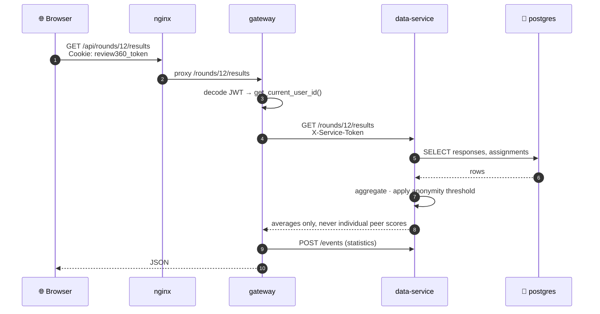
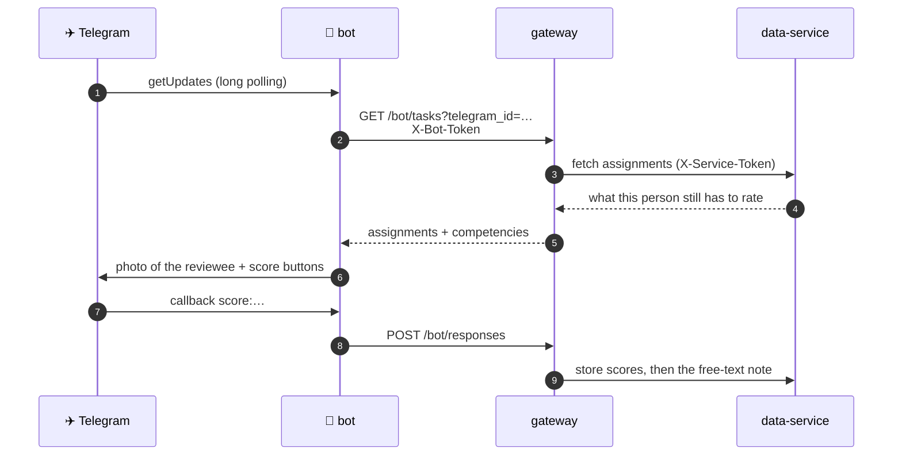
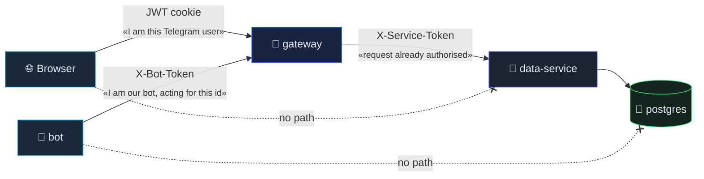
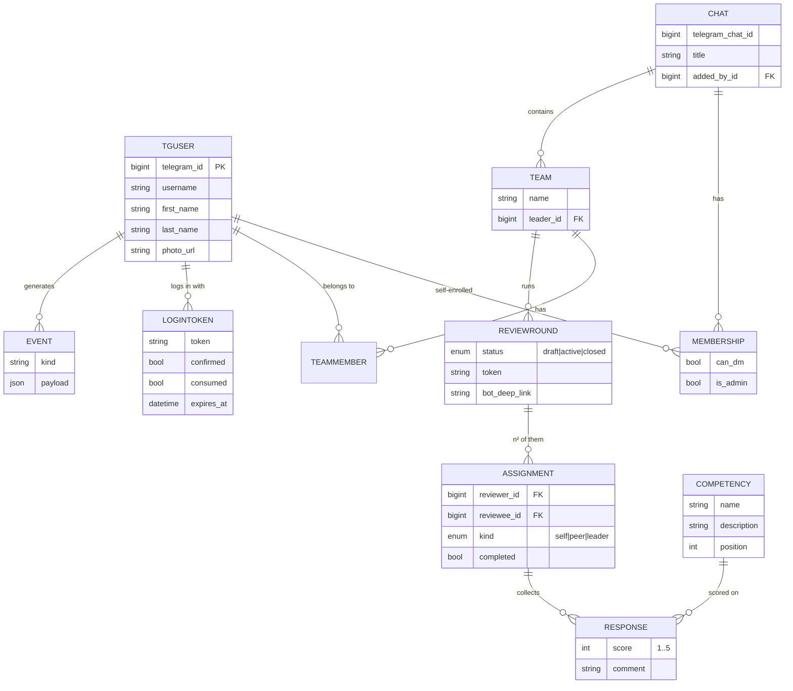
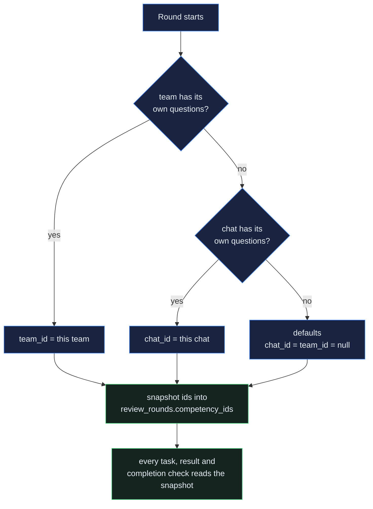
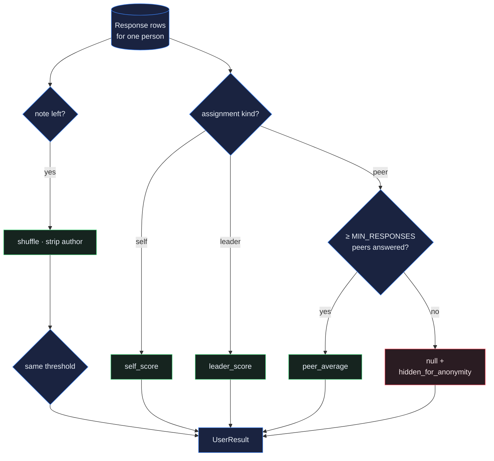

# Architecture

How the pieces fit, and why they were split that way.

---

## Services

| Service | Port | Exposed | Role |
|---|---|---|---|
| `nginx` (project) | 80 | via edge proxy | Serves the SPA, proxies `/api` to the gateway |
| `gateway` | 8010 | no | Public API. Sessions, authorisation, statistics |
| `data-service` | 8011 | no | The only service with database access. Scoring, anonymity |
| `bot` | — | no | aiogram 3, long polling. No inbound port at all |
| `postgres` | 5432 | no | PostgreSQL 16 |

Everything sits on one Docker network. Only the project nginx is reachable from
outside, and in production even that is behind the shared edge proxy.

## Request paths

The bot never touches the database and never mints a session. It authenticates
to the gateway with a shared token and passes the Telegram user id along; the
gateway decides what that user is allowed to see.

## Trust boundaries

Three distinct secrets, three distinct boundaries:

| Secret | Direction | Meaning |
|---|---|---|
| `JWT_SECRET` (cookie) | browser → gateway | "I am this Telegram user, and the site logged me in" |
| `BOT_API_TOKEN` (`X-Bot-Token`) | bot → gateway | "I am our bot, acting on behalf of the id I pass" |
| `SERVICE_TOKEN` (`X-Service-Token`) | gateway → data-service | "I am the gateway, the request is already authorised" |

The data-service trusts the gateway and nothing else. That is what makes the
anonymity guarantee auditable: there is a single door to the data, and the rule
lives behind it.

## Why two backend services

A single FastAPI app would have been shorter to write. The split buys three
things worth the extra process:

1. **The anonymity rule has one home.** No endpoint anywhere can return an
   individual peer score, because the only code that can read `Response` rows is
   the aggregation engine in the data-service.
2. **Identity and truth evolve separately.** Login methods change often (widget,
   deep link, mini-app); the scoring model does not.
3. **Statistics are free.** Every action passes through the gateway, so the
   `Event` log is complete by construction rather than by discipline.

## Data model

A round for a team of *n* members creates *n²* assignments: each member gets one
`self`, plus one per colleague — `leader` when the reviewer is the team lead,
`peer` otherwise.

### Eager loading

Relationships used by the response schemas are declared `lazy="selectin"`.
Without that, serialising an entity after `commit()` raises `MissingGreenlet` —
the async session cannot lazy-load once the transaction is gone. Objects that
are re-read after a commit go through a small `_reload()` helper that expunges
the identity map first, so the `selectin` loaders actually run instead of
handing back a stale instance with unloaded relations.

## Questionnaire scopes

`Competency` rows carry `chat_id` and `team_id`; both null means the seeded
default set. Resolution walks team → chat → default and stops at the first
scope that has any active rows, so a team inherits silently until someone
saves an override.

Two invariants keep old rounds readable:

* **Snapshot on start.** `review_rounds.competency_ids` freezes the list, so
  editing questions afterwards cannot change what a finished round meant — and
  the "is this assignment complete?" check counts against the same snapshot
  rather than whatever rows exist now.
* **Deactivate, never delete.** A question with answers behind it gets
  `is_active = false` instead of a `DELETE`, so historical responses keep their
  label.

## Roster

There is no API that lists a group's members, so `memberships` is assembled
from three sources, none of which needs the user to press anything:

| Source | Covers |
|---|---|
| `getChatAdministrators` | every admin, immediately, with photos |
| `chat_member` updates | anyone joining or leaving while the bot is present |
| any group message | the author — in practice this is what fills the list |

`can_dm` is separate and stricter: it flips only when the person opens a private
chat with the bot, because that is the moment Telegram lets us message them. The
round announcement carries a personal deep link precisely to trigger it, and the
dashboard flags anyone still unreachable.

## Aggregation

`data-service/app/engine/aggregation.py` builds every result:

1. Collect the responses for a person, split by assignment kind.
2. `self_score` — their own answer. `leader_score` — the lead's answer.
3. `peer_average` — the mean of everyone else, **only if** at least
   `MIN_RESPONSES_FOR_RESULTS` (default 3) peers answered; otherwise `None`
   plus `hidden_for_anonymity: true`.
4. Comments — non-empty notes, shuffled, no author, gated by the same threshold.
5. Overall figures — the mean across competencies.

## Frontend

React 18 + TypeScript + Vite, Tailwind v4 via `@theme` tokens, recharts for the
radars, lucide for icons. Session state comes from `/auth/me` on boot; the API
client sends `credentials: 'include'` and surfaces `detail` from FastAPI errors.

Motion is part of the design rather than decoration: page-enter transitions,
staggered card reveals, scrim modals with Escape and outside-click, HTML5
drag-and-drop for team building, and a text-scramble headline stepped on a timer
(with `aria-label`, `aria-hidden` churn and a `prefers-reduced-motion` path).

## Operational surface

- `GET /health` on both services — version, uptime, database reachability.
- `/metrics` on both — Prometheus, via `prometheus-fastapi-instrumentator`.
- `openapi_spec/*.yaml` — written on every boot, so the committed spec can never
  drift from the running code.
- `Event` rows — one per gateway action, aggregated by `GET /api/stats`.
