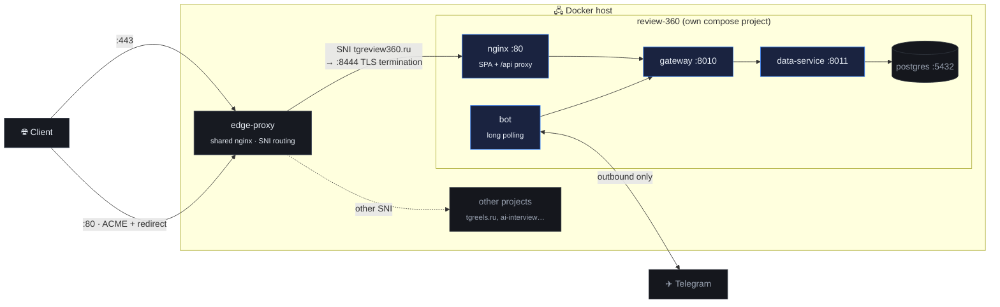

# Deployment

How the live instance at **[tgreview360.ru](https://tgreview360.ru)** is set up, and
what to repeat on another host.

---

## Topology



Two layers of nginx on purpose:

- **The project's own nginx** ships inside the repo and knows nothing about
  domains or certificates. The container is byte-identical on a laptop and in
  production.
- **The shared edge proxy** is the only thing on ports 80/443. It routes by SNI,
  terminates TLS for the domains it owns and passes the rest through untouched,
  so adding a project never risks the ones already running.

## DNS

The domain needs two A records pointing at the host's public address:

| Type | Name | Value |
|---|---|---|
| A | `@` | server's public IP |
| A | `www` | server's public IP |

Nothing else — no CNAME, no MX for this to work. Propagation is usually minutes
on `.ru` at reg.ru, occasionally a couple of hours.

## Bringing the stack up

```bash
cd /mnt/data
git clone git@github.com:simeonkolchin/review-360.git
cd review-360
cp .env.example .env
```

Production values that differ from the defaults:

```ini
PUBLIC_PORT=5081                 # host port, only for debugging; traffic comes via the edge proxy
DEV_LOGIN_ENABLED=false          # signature-free login is for localhost only
SERVICE_TOKEN=<openssl rand -hex 24>
BOT_API_TOKEN=<openssl rand -hex 24>
JWT_SECRET=<openssl rand -hex 32>
DB_PASS=<openssl rand -hex 16>
TELEGRAM_BOT_TOKEN=<from @BotFather>
TELEGRAM_BOT_USERNAME=tgreview360bot
CORS_ORIGINS=https://tgreview360.ru,https://www.tgreview360.ru
```

```bash
chmod 600 .env
docker compose --profile bot up -d --build
```

## Certificates

Issued with certbot in webroot mode: the edge proxy already serves
`/.well-known/acme-challenge/` from a shared directory on port 80, so no service
has to stop.

```bash
docker run --rm \
  -v /etc/letsencrypt:/etc/letsencrypt \
  -v /mnt/data/proxy/certbot-webroot:/var/www/certbot \
  certbot/certbot certonly --webroot -w /var/www/certbot \
  -d tgreview360.ru -d www.tgreview360.ru \
  --agree-tos --no-eff-email -m <email> --non-interactive
```

Renewal runs the same way from a timer; after each renewal the edge proxy is
reloaded (`docker exec edge-proxy nginx -s reload`) so it picks up the new
certificate without dropping connections.

## Edge proxy configuration

Three additions to the shared `nginx.conf`:

```nginx
# 1) TLS termination for this domain, reached from the stream block below
server {
    listen 8444 ssl;
    http2 on;
    server_name tgreview360.ru www.tgreview360.ru;

    ssl_certificate     /etc/letsencrypt/live/tgreview360.ru/fullchain.pem;
    ssl_certificate_key /etc/letsencrypt/live/tgreview360.ru/privkey.pem;
    ssl_protocols TLSv1.2 TLSv1.3;

    location / {
        set $r360 http://review360-frontend:80;   # resolved lazily — see note
        proxy_pass $r360;
        proxy_set_header Host              $host;
        proxy_set_header X-Real-IP         $remote_addr;
        proxy_set_header X-Forwarded-For   $proxy_add_x_forwarded_for;
        proxy_set_header X-Forwarded-Proto https;
    }
}

# 2) ACME challenge + redirect on port 80
server {
    listen 80;
    server_name tgreview360.ru www.tgreview360.ru;
    location /.well-known/acme-challenge/ { root /var/www/certbot; }
    location / { return 301 https://$host$request_uri; }
}
```

```nginx
# 3) in the stream block — route this SNI to the local TLS server
map $ssl_preread_server_name $https_upstream {
    tgreview360.ru      127.0.0.1:8444;
    www.tgreview360.ru  127.0.0.1:8444;
    ...
}
```

The edge proxy also has to join the project's Docker network to reach the
container by name:

```yaml
services:
  edge-proxy:
    networks: [default, review360]
networks:
  review360:
    name: review-360_review360
    external: true
```

> **Why `set $r360 …; proxy_pass $r360;`** — with a literal upstream, nginx
> resolves the name once at startup and refuses to start if the container is not
> running yet. Assigning it to a variable defers resolution to request time (with
> `resolver 127.0.0.11`), so the edge proxy survives restarting any project
> behind it.

## Host-specific notes for this server

Two quirks of this particular machine, worth knowing before debugging:

- **Docker Hub is unreachable** from it (geo-blocked), so images are built on a
  workstation for `linux/amd64` and pushed through a **local registry exposed
  over a reverse SSH tunnel**:

  ```bash
  # workstation
  docker run -d -p 5055:5000 --name r360-registry registry:2
  docker buildx build --platform linux/amd64 -t localhost:5055/review360/gateway:latest --push ./gateway

  # tunnel + pull on the server
  ssh -R 5055:localhost:5055 server 'docker pull localhost:5055/review360/gateway:latest && \
      docker tag localhost:5055/review360/gateway:latest review-360-gateway:latest'
  ```

  Only missing layers travel, so subsequent deploys are small even on a slow
  uplink.

- **`systemd-resolved` on the host is not answering**, so containers that need
  outbound DNS get explicit resolvers through an untracked
  `docker-compose.override.yaml`:

  ```yaml
  services:
    bot:
      dns: [8.8.8.8, 1.1.1.1]
  ```

  Only the bot needs it — everything else talks to service names, which Docker's
  embedded DNS resolves on its own.

## Verifying a deploy

```bash
# containers healthy
docker compose --profile bot ps

# app answers through the edge proxy
curl -sI https://tgreview360.ru | head -1
curl -s  https://tgreview360.ru/api/health

# the bot is connected to Telegram
docker compose logs bot --tail 20      # expect "Start polling" and no 409

# full flow against production
python3 tests/run_flow_test.py --base-url https://tgreview360.ru/api \
        --bot-token "$(grep ^BOT_API_TOKEN= .env | cut -d= -f2)"
```

## Updating

```bash
cd /mnt/data/review-360
git pull
# rebuild locally + push through the tunnel (see above), then:
docker compose --profile bot up -d
```

The database lives in the named volume `review-360_review360_pgdata` and is not
touched by redeploys. `make reset` destroys it — deliberately, and only ever run
by hand.
